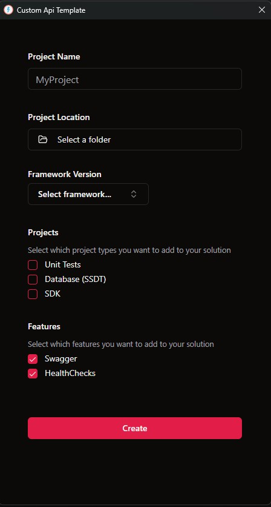

# Project Purpose

The main idea behind this project was to provide a fast and low-cost solution for creating APIs with an architecture similar to what's commonly used in real-world jobs.

# What Custom API Template solves

The biggest pain point was that every time a team needed to start a new API from scratch, they would base it off an existing one — which often resulted in mistakes such as incorrect namespaces, missing implementations, or misconfigured classes.
With the `Custom API Template`, you can consistently generate the same clean and standardized structure every time (fully customizable if needed), avoiding the recurring issues mentioned above.

It can be used via the dotnet CLI or through a UI to make the experience more user-friendly. 😉

# Available Scripts
In the directory `Template.Wizard` run the following scripts:
```bash
npm run build:css
```
```bash
npm run tauri dev
```
If you want to create the installer just run:
```bash
npm run build
```
You can find the installer in `Template.Wizard\src-tauri\target\release\bundle`

## Give a Star! ⭐
If you liked the project or if `Custom API Template` helped you, please give a star 😉

# Installation

### Command

**🔧 Install Nuget Package**

```bash
dotnet new install Custom.Api.Template::1.0.2
```
Parameters:

- -o Location where the generated output will be placed.
- -n <name> Name of the output to be created. If no name is specified, the name of the output directory will be used.
- --Framework Generates the project using the selected .NET framework version.
    Possible values: `net6.0`, `net7.0`, and `net8.0.`
> ⚠️ *Make sure the selected .NET framework is already installed on your machine.*
- --IncludeSdk Includes an SDK project in the solution.
- --IncludeDataTool Includes a SQL Server Data Tools (SSDT) database project.
> ⚠️ *If you include SSDT proyect, you must have `.NET Framework 4.8.1` installed.*
- --IncludeUnitTests Includes a Unit Test project.
- --Swagger Adds Swagger support to the project.
- --HealthChecks Adds HealthChecks support to the project

**🛠️ Template Parameters**
```bash
dotnet new CustomApiTemplate -o "C://Example" -n "ProyectName" --Framework "net8.0" --IncludeSdk true --IncludeDataTool true --IncludeUnitTests true --Swagger true --HealthChecks true
```

    
**Mas información DotNet CLI:**
https://learn.microsoft.com/es-es/dotnet/core/tools/dotnet

### UI (Recommended)

You can download the Windows installer from the Release section

📥 [Release 1.0.3](https://github.com/LeonardoFaggiani/Template/releases/tag/1.0.4)

You choose the project name, the location where you want to create it, and the different types of projects to include in your solution.
<p align="center">
  
</p>
